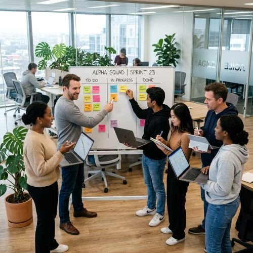

## Financial/Career

- I now work at IBM in a team of other UX designers that work on various projects together.
- Some projects call for the help of co-op students in the form of internships.
- This job is temporary and my goal is to manage a team of my own in the form of a scrum master/team leader.
- I have no student debt from my time studying at Laurier in UX design.
