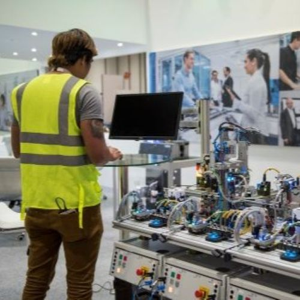

## Education

- I've completed my Honours Bachelor of Design at Wilfrid Laurier a part of the UX design program.
- I graduated a couple of years ago now and plan to go back to university soon.
- I want to go into mechatronics and learn more about autonomy and maintaining machinery, as I think
  robotics is where the future is heading.
